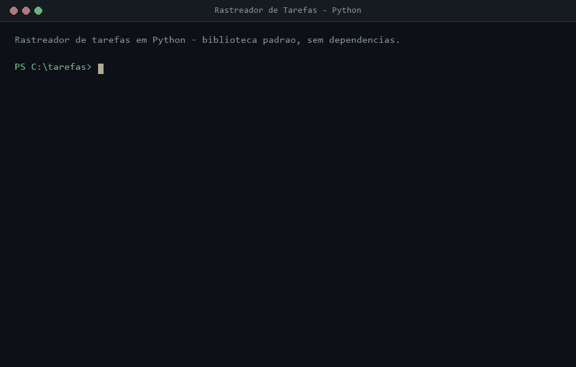

# Rastreador de Tarefas (Task Tracker)

Aplicacao de linha de comando para acompanhar o que voce precisa fazer, o que
esta em andamento e o que ja foi concluido. As tarefas sao guardadas em um
arquivo JSON no proprio diretorio de trabalho, sem banco de dados e sem
nenhuma dependencia externa.

Este projeto e uma solucao para o desafio
[Task Tracker](https://roadmap.sh/projects/task-tracker) do roadmap.sh.

## Sumario

- [Demonstracao](#demonstracao)
- [Requisitos](#requisitos)
- [Instalacao](#instalacao)
- [Uso](#uso)
- [Como os dados sao guardados](#como-os-dados-sao-guardados)
- [Tratamento de erros](#tratamento-de-erros)
- [Estrutura do projeto](#estrutura-do-projeto)
- [Arquitetura](#arquitetura)
- [Testes](#testes)
- [Decisoes de implementacao](#decisoes-de-implementacao)
- [Licenca](#licenca)

## Demonstracao



A animacao acima nao e uma montagem: o script `scripts/gerar_gif.py` executa os
comandos de verdade em um diretorio temporario, captura a saida real e desenha
o terminal quadro a quadro. Para gerar o arquivo novamente:

```bash
python -m pip install pillow
python scripts/gerar_gif.py
```

O Pillow e necessario apenas para produzir o GIF; a aplicacao continua sem
nenhuma dependencia externa.

## Requisitos

- Python 3.10 ou superior (o codigo usa anotacoes de tipo modernas).
- Nenhuma biblioteca externa: tudo vem da biblioteca padrao (`argparse`,
  `json`, `pathlib`, `dataclasses`, `tempfile`, `datetime`).

Confira a versao instalada:

```bash
python --version
```

## Instalacao

```bash
git clone <url-do-repositorio>
cd task-tracker
python task_cli.py --help
```

Nao ha nada para compilar nem pacotes para baixar.

Para digitar menos, crie um atalho no seu shell:

```bash
# Linux ou macOS (bash/zsh)
alias task-cli="python /caminho/para/task-tracker/task_cli.py"
```

```powershell
# Windows (PowerShell)
function task-cli { python C:\caminho\para\task-tracker\task_cli.py @args }
```

Os exemplos abaixo usam `task-cli`; sem o atalho, troque por
`python task_cli.py`.

## Uso

Formato geral:

```
task-cli [--arquivo CAMINHO] <comando> [argumentos]
```

| Comando            | Argumentos          | O que faz                                   |
| ------------------ | ------------------- | ------------------------------------------- |
| `add`              | `descricao`         | Cria uma tarefa com status `todo`           |
| `update`           | `id`, `descricao`   | Troca a descricao de uma tarefa             |
| `delete`           | `id`                | Remove uma tarefa                           |
| `mark-in-progress` | `id`                | Marca a tarefa como `in-progress`           |
| `mark-done`        | `id`                | Marca a tarefa como `done`                  |
| `list`             | `status` (opcional) | Lista todas as tarefas ou filtra por status |

Os status aceitos sao `todo`, `in-progress` e `done`, conforme o enunciado do
desafio. A saida no terminal usa os nomes em portugues: `a fazer`,
`em andamento` e `concluida`.

### Adicionar uma tarefa

```bash
task-cli add "Comprar mantimentos"
```

```
Tarefa adicionada com sucesso (ID: 1).
```

O identificador e sequencial e comeca em 1. Descricoes vazias ou compostas
apenas de espacos sao recusadas.

### Atualizar a descricao

```bash
task-cli update 1 "Comprar mantimentos e cozinhar o jantar"
```

```
Tarefa 1 atualizada com sucesso.
```

### Remover uma tarefa

```bash
task-cli delete 1
```

```
Tarefa 1 removida com sucesso.
```

### Mudar o status

```bash
task-cli mark-in-progress 2
task-cli mark-done 3
```

```
Tarefa 2 marcada como em andamento.
Tarefa 3 marcada como concluida.
```

### Listar tarefas

Todas as tarefas:

```bash
task-cli list
```

```
ID  DESCRICAO            STATUS        ATUALIZADA EM
--  -------------------  ------------  -------------
1   Comprar mantimentos  a fazer       2026-09-09T23:10:07+00:00
2   Estudar Python       em andamento  2026-09-09T23:10:07+00:00
3   Lavar a louca        concluida     2026-09-09T23:10:07+00:00

Total: 3 tarefas.
```

Filtrando por status:

```bash
task-cli list todo
task-cli list in-progress
task-cli list done
```

Quando nada corresponde ao filtro, a saida e:

```
Nenhuma tarefa encontrada.
```

### Escolher outro arquivo de dados

Por padrao o arquivo `tarefas.json` do diretorio atual e usado. A opcao
`--arquivo` aponta para outro caminho, util para separar contextos:

```bash
task-cli --arquivo ~/pessoal.json add "Marcar consulta"
task-cli --arquivo ~/trabalho.json list
```

## Como os dados sao guardados

O arquivo JSON e uma lista de objetos com as chaves definidas no enunciado do
desafio:

```json
[
  {
    "id": 1,
    "description": "Comprar mantimentos e cozinhar o jantar",
    "status": "todo",
    "createdAt": "2026-09-09T23:10:07+00:00",
    "updatedAt": "2026-09-09T23:10:08+00:00"
  },
  {
    "id": 2,
    "description": "Estudar Python",
    "status": "in-progress",
    "createdAt": "2026-09-09T23:10:07+00:00",
    "updatedAt": "2026-09-09T23:10:07+00:00"
  }
]
```

Pontos importantes:

- O arquivo e criado automaticamente na primeira gravacao.
- As datas ficam em UTC, no formato ISO 8601 com precisao de segundos.
- A gravacao e atomica: o conteudo vai primeiro para um arquivo temporario no
  mesmo diretorio e so entao substitui o original. Se o processo for
  interrompido no meio, o arquivo antigo continua intacto.
- O JSON e gravado com `ensure_ascii=False`, entao acentos aparecem como
  acentos e nao como sequencias de escape.

## Tratamento de erros

Situacoes previstas viram mensagens claras na saida de erro, e o processo
termina com codigo de saida `1`:

```bash
task-cli mark-done 42
```

```
Erro: nenhuma tarefa encontrada com o id 42
```

Sao tratados: id inexistente, descricao vazia, status invalido, arquivo com
JSON malformado, arquivo com estrutura diferente de uma lista e falhas de
leitura ou escrita no disco. Em caso de sucesso o codigo de saida e `0`, o que
permite encadear comandos em scripts.

## Estrutura do projeto

```
task-tracker/
  task_cli.py              Executavel: chama rastreador.cli.main
  rastreador/
    __init__.py            Exporta os componentes publicos do pacote
    modelo.py              Entidade Tarefa, status e serializacao
    armazenamento.py       Leitura e gravacao atomica do arquivo JSON
    servico.py             Regras de negocio das operacoes
    cli.py                 Analise de argumentos e formatacao da saida
  testes/
    test_servico.py        Testes das regras de negocio
    test_cli.py            Testes da linha de comando
  scripts/
    gerar_gif.py           Gera a animacao de demonstracao do README
  docs/
    demonstracao.gif       Demonstracao usada no README
  .gitignore
  README.md
```

## Arquitetura

O codigo esta dividido em camadas com responsabilidades bem separadas:

```
cli.py  ->  servico.py  ->  armazenamento.py  ->  tarefas.json
                |
            modelo.py
```

- **`modelo.py`** guarda a entidade `Tarefa` (uma `dataclass`) e a traducao
  entre os nomes em portugues usados no codigo e as chaves em ingles exigidas
  pelo arquivo JSON.
- **`armazenamento.py`** e o unico modulo que toca o disco. Ele nao conhece
  regras de negocio.
- **`servico.py`** concentra as regras: gerar identificadores, validar
  descricoes, localizar tarefas e aplicar mudancas de status. Nao imprime nada;
  falhas previstas viram `ErroDeTarefa`.
- **`cli.py`** cuida apenas dos argumentos e do texto exibido.

Essa separacao mantem os testes rapidos e permite usar o servico
programaticamente, sem passar pela linha de comando:

```python
from rastreador import RepositorioJson, ServicoDeTarefas

servico = ServicoDeTarefas(RepositorioJson("tarefas.json"))
tarefa = servico.adicionar("Comprar mantimentos")
servico.marcar_concluida(tarefa.identificador)
```

## Testes

A suite usa `unittest`, da biblioteca padrao. Cada teste roda sobre um arquivo
JSON temporario e isolado, entao nada no seu diretorio de trabalho e alterado.

```bash
python -m unittest discover -s testes -t .
```

Com saida detalhada:

```bash
python -m unittest discover -s testes -t . -v
```

Sao 16 testes cobrindo o ciclo de vida completo de uma tarefa, os filtros de
listagem, o formato do arquivo JSON e os casos de erro.

## Decisoes de implementacao

- **Nomes de comando em ingles, mensagens em portugues.** Os comandos seguem o
  enunciado do desafio (`add`, `list`, `mark-done`), o que mantem a
  compatibilidade com os exemplos do roadmap.sh, enquanto toda a interacao com
  quem usa a ferramenta acontece em portugues.
- **Identificadores sequenciais.** O proximo id e o maior id existente mais um.
  E simples e garante que nenhum id em uso seja duplicado.
- **Sem dependencias externas.** O desafio pede o uso do modulo nativo de
  sistema de arquivos, entao nada de bibliotecas de terceiros.
- **Gravacao completa a cada comando.** A lista inteira e reescrita a cada
  alteracao. Para o volume esperado de uma lista pessoal de tarefas isso e
  irrelevante em desempenho e elimina uma classe inteira de bugs de escrita
  parcial.

## Licenca

Distribuido sob a licenca MIT. Veja o arquivo [LICENSE](LICENSE).
